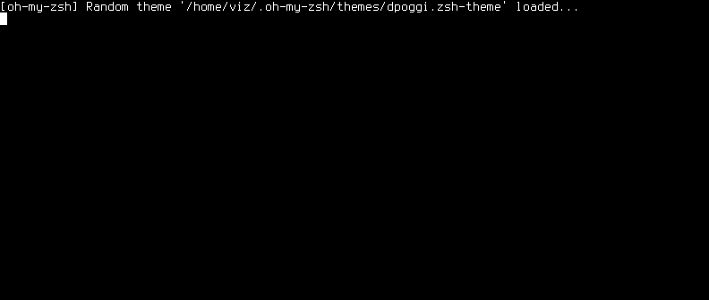

# Golife
Conway's Game of Life Implementation in Ruby



## Installation
```
    gem install golife-cli
```

## Usage
Just run the `golife` command as follows
```
golife
```

## Development
To run in Development mode:
```
    bundle exec ./exe/golife
```

Building gem:
```
    gem build golife-cli.gemspec
```

Install from generated gem:
```
    gem install golife-cli-<version>.gem
```

Publishing to RubyGems:
```
    gem push golife-cli-<version>.gem
```

~~After checking out the repo, run `bin/setup` to install dependencies. Then, run `rake test` to run the tests. You can also run `bin/console` for an interactive prompt that will allow you to experiment.

To install this gem onto your local machine, run `bundle exec rake install`. To release a new version, update the version number in `version.rb`, and then run `bundle exec rake release`, which will create a git tag for the version, push git commits and tags, and push the `.gem` file to [rubygems.org](https://rubygems.org).~~


## To Do
- [x] Refactoring code and Optimize logic
- [ ] Add Ncurses
- [x] Create an executable gem
- [ ] Take input from user instead of random cells
- [ ] Add predefined cells like Glider, Gun, Blink, Box
- [ ] Command line arguments
- [ ] Unit tests
- [x] Zero player (random)
- [ ] Multiplayer support(LAN, Internet)
- [ ] Different colors of cells


## Rules
- Any live cell with fewer than two live neighbours dies, as if by needs caused by underpopulation.
- Any live cell with more than three live neighbours dies, as if by overcrowding.
- Any live cell with two or three live neighbours lives, unchanged, to the next generation.
- Any dead cell with exactly three live neighbours becomes a live cell.


## Contributing
Bug reports and pull requests are welcome on GitHub at https://github.com/vs4vijay/golife. This project is intended to be a safe, welcoming space for collaboration, and contributors are expected to adhere to the [Contributor Covenant](http://contributor-covenant.org) code of conduct.


## License

The gem is available as open source under the terms of the [MIT License](http://opensource.org/licenses/MIT).
